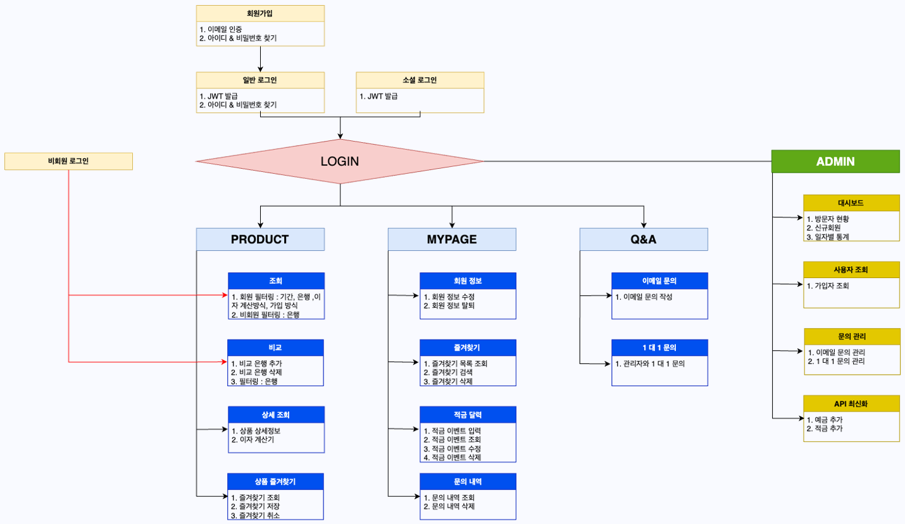
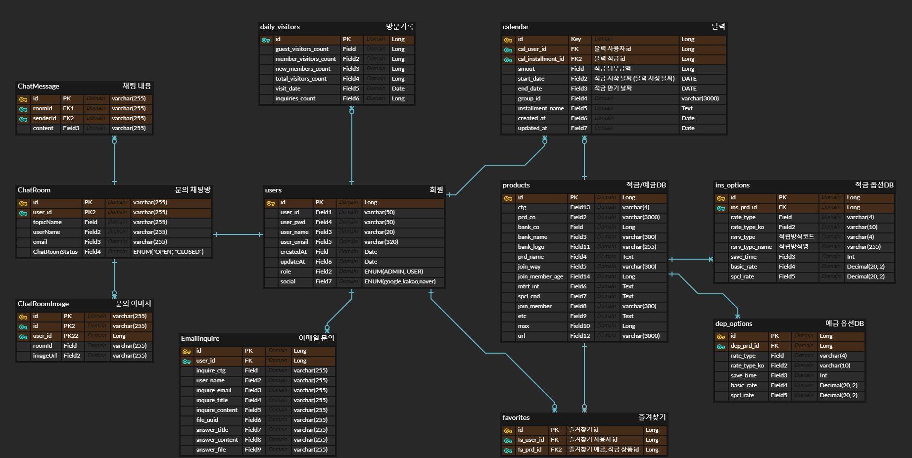

# Dr.Rate (금융 상품 사이트)

[](public/ReadMe/Dr_Rate_thumbnail.png)
<br/><br/>
[Dr.Rate PDF 미리보기](public/ReadMe/Dr_Rate_presentation.pdf) 
<br/><br/>
[Dr.Rate 서비스 링크](https://www.dr-rate.store/) (새 탭에서 열기: 오른쪽 클릭 후 새 탭에서 열기 선택)
<br/><br/>
[Dr.Rate 시연영상 링크](https://www.youtube.com/watch?v=nGptuUa_gHI) (새 탭에서 열기: 오른쪽 클릭 후 새 탭에서 열기 선택)
<br/><br/>


## Abstract ##
**Dr.Rate** 는 금리박사는 사용자가 다양한 은행의 예금 및 적금 상품을 검색, 비교할 수 있는 금융 상품 플랫폼입니다. 이 시스템은 사용자 서비스와 관리자 서비스를 통해 금융 상품의 등록, 관리 및 사용자 맞춤형 서비스를 제공합니다.
<br/><br/>
사용자는 회원 가입과 로그인을 통해 개인 정보를 관리하며, 다양한 예금 및 적금 상품을 필터링하고 비교할 수 있습니다. 또한, 원하는 상품을 즐겨찾기에 추가하여 관리하고, 예상 납입 금액 및 이자 정보를 계산할 수 있습니다. 사용자는 문의 기능을 통해 텍스트와 이미지를 활용한 질문을 등록하고 관리할 수 있습니다.
<br/><br/>
관리자는 상품 정보를 등록, 수정, 삭제할 수 있으며, 데이터를 체계적으로 관리하여 사용자에게 정확하고 신뢰성 있는 금융 정보를 제공합니다.
<br/><br/>
**금리박사**는 사용자 친화적인 인터페이스와 효율적인 데이터 관리로 금융 상품에 대한 정보를 쉽게 검색하고 비교할 수 있는 환경을 제공합니다.

<br/><br/>

## 🛠️ 개발 환경
- **프로그래밍 언어**: HTML, SCSS, JavaScript
- **IDE**: IntelliJ, STS4 (jdk-17)
- **DBMS**: MySQL, Redis, MongoDB, Apache Kafka
- **버전 관리**: g]Git, GitHub
- **Naver Cloud DB**: dr-rate-db
- **Naver Cloud Object Storage**: dr-rate

<br/><br/>

## 👀 IA(Information Architecture)	


<br/><br/>

## 📰 Database	



<br/><br/>
## 🎰 주요 기능

### 회원 서비스
  
1. **회원 기능**
	- 회원가입
 	- 로그인 (일반 로그인/소셜 로그인)
  	- id/pw 찾기
  	- 회원정보 수정
  	- 회원 탈퇴

2. **상품 기능**
  	- 상품 조회
  	- 상품 비교
  	- 상품 즐겨찾기

3. **마이페이지**
  	- 예금, 적금 즐겨찾기
  	- 회원 정보 조회
  	- 적금 달력
  	- 문의 내역 조회

4. **문의**
  	- 이메일 문의
  	- 1:1 문의


### 관리자 서비스
1. **대시보드**
   	- 방문자 집계
   	- 신규 회원
   	- 문의 내역

3. **사용자 조회**

4. **이메일 문의 내역**
	- 이메일 문의 답변
	- 사용자 이메일 문의 내역 조회

5. **1:1 문의 내역**
	- 1:1 문의 답변
	- 사용자 1:1 문의 내역 조회

6. **상품 api 갱신** 

<br/><br/>

## 🗒️사용법
1. 사용자 가입 및 로그인:
	- 새로운 사용자는 사용자 이름, 아이디, 이메일, 비밀번호를 입력하여 가입할 수 있습니다.
  	- 가입된 사용자는 아이디와 비밀번호를 사용하여 로그인할 수 있습니다.

2. 상품 조회 및 비교:
  	- 사용자는 은행 필터로 예금, 적금 상품을 조회, 비교할 수 있습니다.
  	- 로그인 후 은행, 나이, 저축 예정 기간, 이자 계산 방식, 가입 방식 필터로 더 상세한 상품 조회와 즐겨찾기 등록이 가능합니다.

3. 마이페이지:
  	- 예금, 적금 즐겨찾기 목록 조회, 검색, 삭제가 가능합니다.
  	- 회원 정보 조회 및 수정, 탈퇴할 수 있습니다.
  	- 적금 달력으로 적금 납부 기간, 금액 등을 관리할 수 있습니다.
  	- 이메일 문의, 1:1 문의 내역 조회가 가능합니다.
	
4. 문의:
  	- 사용자는 이메일 문의를 할 수 있습니다.
  	- 사용자는 관리자와 1:1 채팅을 할 수 있습니다.

  

<br/><br/>

  
## 🪪 팀 소개

```
오영수
E-mail : paul9119298@gmail.com
```

```
김세현
E-mail : kshyeon114@gmail.com
```

```
김진환
E-mail : ghks248@naver.com
```

```
박상욱
E-mail : anfto02@naver.com
```

```
박채연
E-mail : p3chaeyeon@gmail.com
```

```
양수민
E-mail : kongdot0709@gmail.com
```

```
오혜진
E-mail : srin5@naver.com
```

```
조윤성
E-mail : yunseong0220@hanmail.net
```
<br/><br/>

## 🧩역할

|   이름   | 주요 작업                    |
| ------ | --------------------------- |
| 오영수 | 관리자 메인, 회원 조회, 문의 조회 화면 작업  |
| 김세현 | 예금•적금 상세, 예금•적금 비교 화면 작업 |
| 김진환 | 회원가입, 로그인 화면 작업 |
| 박상욱 | 회원조회, 회원정보수정, 회원탈퇴 화면 작업 |
| 박채연 | 사용자 메인, 예금•적금 목록, 마이페이지 상품 즐겨찾기, 마이페이지 문의 내역 화면 작업 |
| 양수민 | 고객센터, 이메일 문의 화면 작업 |
| 조윤성 | 마이페이지 적금달력 화면 작업 |


## 🤝 기여

본 프로젝트는 오픈 소스 프로젝트로, 기여를 원하시는 분은 [GitHub 리포지토리](https://github.com/your-repo)에서 문제를 보고하거나 Pull Request를 통해 기여해 주세요.

---

이 `README.md` 파일은 `FilmNote`의 구조와 기능을 이해하는 데 도움이 될 것입니다. 필요한 경우, 추가적인 정보와 자세한 설명을 포함하여 프로젝트의 문서를 보강할 수 있습니다.


<br/><br/><br/><br/>


# 프로젝트 실행
## 로컬 실행
```
git clone https://github.com/BitCamp-Final-Project/Dr.Rate-Frontend.git
cd dr_rate_front
git pull origin dev

npm install --global yarn
yarn --version # 1.22.22
yarn install


yarn add react-router-dom           # 클라이언트 측 라우팅 지원
yarn add axios                      # HTTP 요청을 처리
yarn add jotai                      # 경량 상태 관리
yarn add sass                       # scss 사용 라이브러리
yarn add @fullcalendar/react @fullcalendar/daygrid @fullcalendar/interaction @fullcalendar/core
yarn add react-modal                # @FullCalendar 라이브러리 설치, modal
yarn add chart.js react-chartjs-2   # 관리자 페이지 그래프 라이브러리
yarn add jsonwebtoken               # JWT 토큰 생성 라이브러리
npm install sockjs-client           # WebSocket 연결을 위한 라이브러리
npm install @stomp/stompjs          # STOMP Protocol 라이브러리


yarn dev

```


## 빌드
`yarn build`

---

Currently, two official plugins are available:

- [@vitejs/plugin-react](https://github.com/vitejs/vite-plugin-react/blob/main/packages/plugin-react/README.md) uses [Babel](https://babeljs.io/) for Fast Refresh
- [@vitejs/plugin-react-swc](https://github.com/vitejs/vite-plugin-react-swc) uses [SWC](https://swc.rs/) for Fast Refresh
